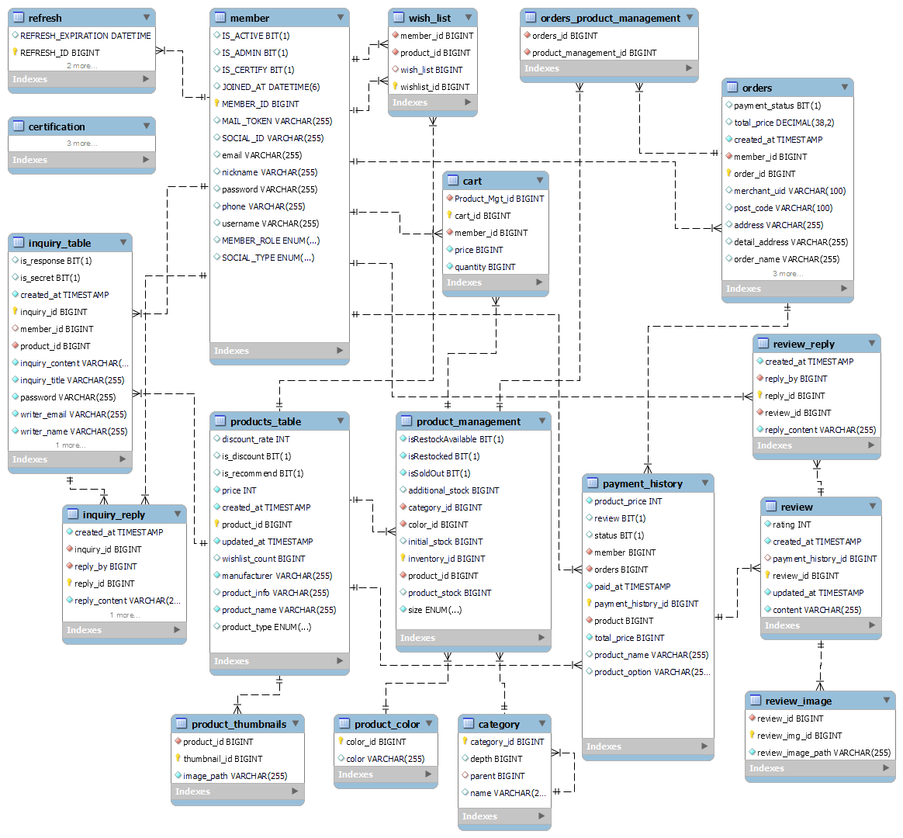

장바구니 기능 구현하기 한가지로 축약
- 상품
- 장바구니
- 주문
- 결제

---
참고
https://chaeyami.tistory.com/252

1. 엔티티
2. 컨트롤러
3. 서비스 로직
4. 테스트

복사 붙여넣기만 하고 아무것도 할 줄 모르는 중
배워야되긴해
공식문서도 있고 인터넷강의도 있고
https://www.thymeleaf.org
https://spring.io/guides/gs/serving-web-content
https://docs.spring.io/spring-boot/docs/2.3.1.RELEASE/reference/html/spring-boot-features.html#boot-features-spring-mvc-template-engines
기초 기본기 응용해서 구현하면 될 일을 여태 뭐한거지..?
https://github.com/fortune-man/jpashop2/tree/main
